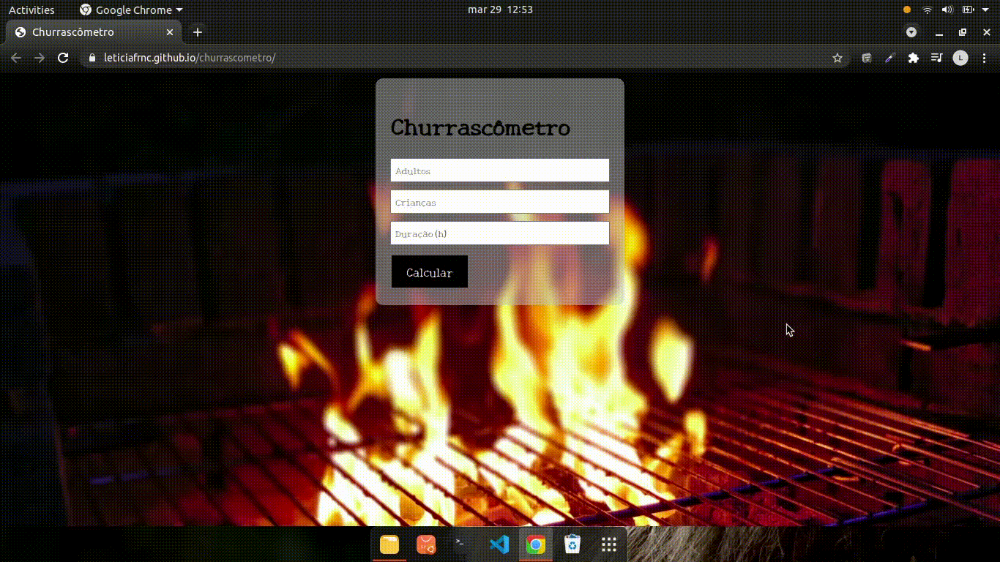

# churrascometro
### Churrascômetro

O Churrascômetro foi desenvolvida com HTML e CSS e JS com o objetivo de demostrar meu aprendizado com o objeto Math. 

### Características
Esta Landing Page é uma maneira de calcular a quantidade de carne e bebida por pessoa de acordo com o tempo que esse churrasco acontecerá a lógica por trás estabelecida é :

* Carne - 400g por pessoa, caso seja mais de 6 horas a quantodade estabecida é 650g
* Cerveja - 1200 ml por pessoa,caso seja mais de 6 horas a quantidade é 2000ml
* Refrigerante e Água - 1000ml por pessoa, se for mais de 6 horas 1500ml
* Crianças contam meio.

### Instalação 

Clone este repositório usando git clone https://github.com/Leticiafrnc/churrascometro.git ou clique em Code/Download ZIP.
Clique no arquivo "index.HTML" e veja a aplicação.

